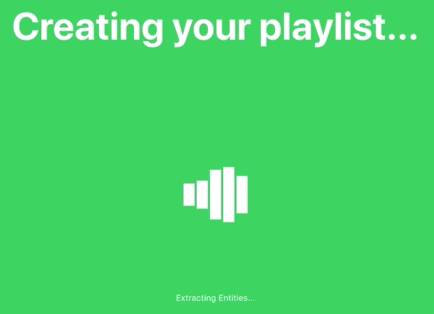

# Jukebox

Last Updated - 04.07.2017

A chrome extension using google and spotify APIs to create a spotify playlist from a YouTube playlist URL.



## Take note

This is my first ever individual project that Ive seen to completion. I did this a long time ago, so it might not represent the best programming practices. But I decided to upload it anyways as a referrance material.

### Prerequisites

What things you need to install the software and how to install them

```
Give examples
```

### Installing

A step by step series of examples that tell you how to get a development env running

Say what the step will be

```
Give the example
```

And repeat

```
until finished
```

End with an example of getting some data out of the system or using it for a little demo

## Running the tests

Explain how to run the automated tests for this system

### Break down into end to end tests

Explain what these tests test and why

```
Give an example
```

## Deployment

Add additional notes about how to deploy this on a live system

## ToDo: 
 - Find a way to intergrate natural language processing, so that its possible to identify whethere or not a string is an artists name or the title of the song. Rather than relying of pre-set formatting.
